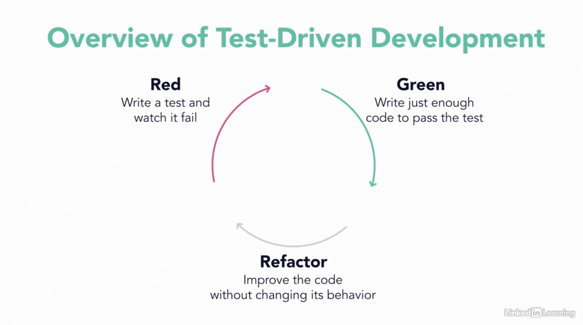
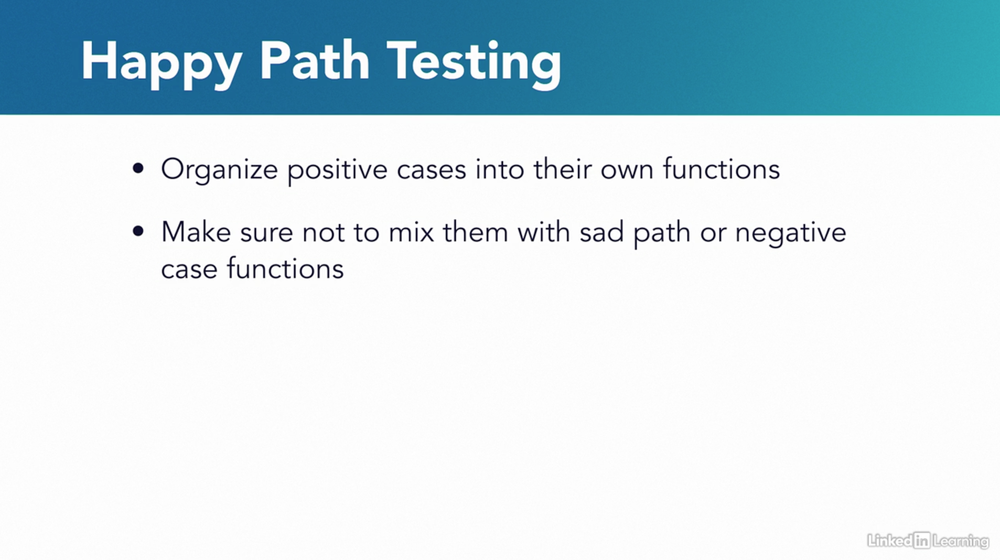
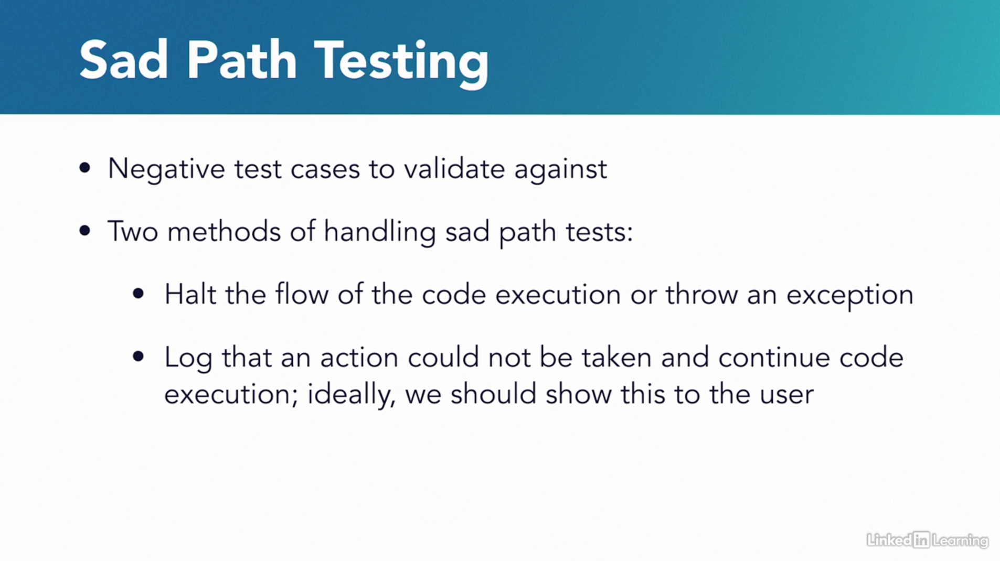

#

## Overview of TDD



- Before moving to our exercises, I want to take a step back to explain how test-driven development relates to unit
testing. As we move through this section we will primarily use the lens of test-driven development to implement
functionality in the source code and write accompanying tests. To guide how we use test-driven development, it's
important to first think about what behaviors we want our system to execute, even before we implement it in code.
- **Test-driven development is a software development process that can be used while writing unit tests.** Using this
method of writing software at the start, influences how the developer writes modular tests that will illustrate what
features their system will carry out.
  - First, the developer writes a test that will surely fail without code to implement its behavior. This is also known
  as being in a red failure state.
  - Then the developer must make sure it eventually passes by writing the minimum implementation code needed to get this
  test passing.
  - Once that's been done, this test, along with the rest of the tests should be run to make sure the entire project is
  in a passing state. If the new implementation code has caused other tests to fail, then the developer needs to
  refactor as necessary.
  - After all needed factoring is complete the tests are now in a green, or passing state. This shortens the development
  cycle, influencing the developer to focus on functionality in small pieces on the forefront. It's their job to
  iteratively stitch these pieces together to get a final system. Additionally, when behaviors are clearly defined
  during the development process, the developer can think about ways they might extend the project to include new
  features in the future. As such, new code written down the line can be structured to potentially build-off of or
  reuse existing behaviors. This helps the developer avoid being overwhelmed by the desire to implement all the core
  functionality at once. Instead, they can focus on gradually adding features as they go.
- Using test-driven development with behaviors in mind also facilitates code reuse in the broader community. Think about
it like this, if you downloaded another developer's project that promised to solve a huge problem you had, you'd expect
to make use of the functionality they promised. However, if you ran their code and encountered errors, you most likely
avoid using their projects and search for another solution. To avoid a situation like this ourselves, it's important to
communicate behaviors explicitly as you develop, verifying that those behaviors are indeed occurring. We will use the
test-driven development method of writing tests strategically within this course with behaviors in mind. As we do this,
we will cover basic debugging tips and tricks that will help us navigate the refactoring process as we attempt to get
our test passing again, or in the green.

## Basic tests and assertions

### Sources

* [mapmaker_start.py](https://github.com/thehimel/dockerized-pytest-course/blob/master/scripts/chp2/video2/mapmaker_start.py)
* [test_mapmaker_start.py](https://github.com/thehimel/dockerized-pytest-course/blob/master/tests/chp2/video2/test_mapmaker_start.py)

```python
# Author: coding-geographies

class Point():
    def __init__(self, name, latitude, longitude):
        self.name = name
        self.latitude = latitude
        self.longitude = longitude


    def get_lat_long(self):
        return (self.latitude, self.longitude)

def test_make_one_point():
    p1 = Point("Dakar", 14.7167, 17.4677)
    assert p1.get_lat_long() == (14.7167, 17.4677)

# pytest -k test_make_one_point
```

## Exceptions

### Sources

* [mapmaker_solution.py](https://github.com/thehimel/dockerized-pytest-course/blob/final-state-per-chapter/scripts/chp2/video5/mapmaker_solution.py)
* [test_chp2_solution.py](https://github.com/thehimel/dockerized-pytest-course/blob/final-state-per-chapter/tests/chp2/video5/test_chp2_solution.py)

```python
# Author: coding-geographies
import pytest

class Point():
    def __init__(self, name, latitude, longitude):
        if not isinstance(name, str):
            raise ValueError("City name provided must be a string")
        self.name = name

        if not (-90 <= latitude <= 90) or not (-180 <= longitude <= 180):
            raise ValueError("Invalid latitude, longitude combination.")
        self.latitude = latitude
        self.longitude = longitude


    def get_lat_long(self):
        return (self.latitude, self.longitude)


def test_invalid_point_generation():
    with pytest.raises(ValueError) as exp:
        Point("Senegal", 99.6937, -189.44406)
    assert str(exp.value) == "Invalid latitude, longitude combination."

    with pytest.raises(ValueError) as exp:
        Point(5, 12.11386, -55.08269)
    assert str(exp.value) == 'City name provided must be a string'
```

## Happy path testing




### Sources

* [test_happy_path_end.py](https://github.com/thehimel/dockerized-pytest-course/blob/final-state-per-chapter/tests/chp2/video6/test_happy_path_end.py)

```python
# Author: coding-geographies
import pytest
import csv


def csv_reader(file_location):
    with open(file_location, mode='r') as csv_file:
        data = [line for line in csv.DictReader(csv_file)]
        for row in data:
            try:
                row['Lat'] = float(row['Lat'])
                row['Long'] = float(row['Long'])
                row['Altitude'] = float(row['Altitude'])
            except Exception as exp:
                raise ValueError(str(exp))

        return data

@pytest.fixture(scope="module")
def city_list_location():
    return 'tests/resources/cities/clean_map.csv'


@pytest.fixture(scope="module")
def process_data(city_list_location):
    yield csv_reader(city_list_location)


def test_csv_reader_header_fields(process_data):
    """
    Happy Path test to make sure the processed data
    contains the right header fields
    """
    # helper function imported from conftest.py to import file data with our csv reader
    data = process_data
    header_fields = list(data[0].keys())
    assert header_fields == [
            'Country',
            'City',
            'State_Or_Province',
            'Lat',
            'Long',
            'Altitude'
            ]


def test_csv_reader_data_contents(process_data):
    """
    Happy Path Test to examine that each row
    had the appropriate data type per field
    """
    data = process_data

    # Check row types
    for row in data:
        assert(isinstance(row['Country'], str))
        assert(isinstance(row['City'], str))
        assert(isinstance(row['State_Or_Province'], str))
        assert(isinstance(row['Lat'], float))
        assert(isinstance(row['Long'], float))
        assert(isinstance(row['Altitude'], float))

    # Basic data checks
    assert len(data) == 180  # We have collected 180 rows
    assert data[0]['Country'] == 'Andorra'
    assert data[106]['Country'] == 'Japan'
```

## Sad path testing

### Sources

* [data_processor_end.py](https://github.com/thehimel/dockerized-pytest-course/blob/final-state-per-chapter/scripts/chp2/video7/data_processor_end.py)
* [test_sad_path_end.py](https://github.com/thehimel/dockerized-pytest-course/blob/final-state-per-chapter/tests/chp2/video7/test_sad_path_end.py)

```python
# Author: coding-geographies
import pytest
import csv
import json


def csv_reader(file_location):
    with open(file_location, mode='r') as csv_file:
        data = [line for line in csv.DictReader(csv_file)]
        for row in data:
            try:
                row['Lat'] = float(row['Lat'])
                row['Long'] = float(row['Long'])
                row['Altitude'] = float(row['Altitude'])
            except Exception as exp:
                raise ValueError('Invalid input: ' + str(exp))

        return data


def json_reader(file_location):
    with open(file_location) as f:
        return json.load(f)


@pytest.fixture(scope="function")
def city_list_location_malformed():
    return 'tests/resources/cities/malformed_map.csv'


def test_csv_reader_malformed_data_contents(city_list_location_malformed):
    """
    Sad Path Test
    """
    with pytest.raises(ValueError) as exp:
        csv_reader(city_list_location_malformed)
    assert str(exp.value) == "Invalid input: could not convert string to float: 'not_an_altitude'"
```
