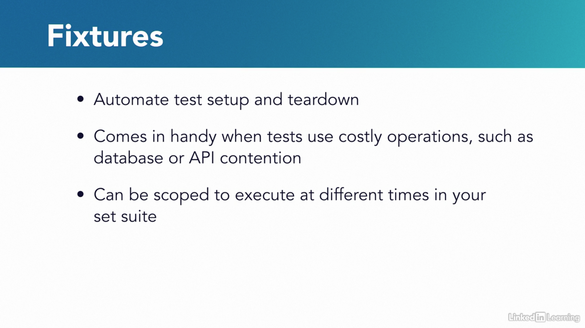
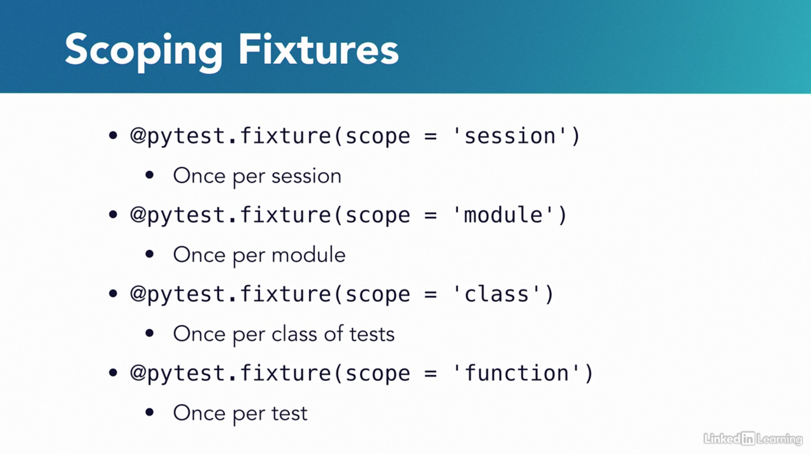

# Test Automation with Fixtures and Parametrization

## Fixtures to amortize costly operations




## Parametrization

### Sources

* [parametrize.html](https://docs.pytest.org/en/6.2.x/parametrize.html)

```python
# Author: coding-geographies

import pytest


@pytest.mark.parametrize("test_input,expected", [("3+5", 8), ("2+4", 6), ("6*9", 54)])
def test_eval(test_input, expected):
    assert eval(test_input) == expected
```
