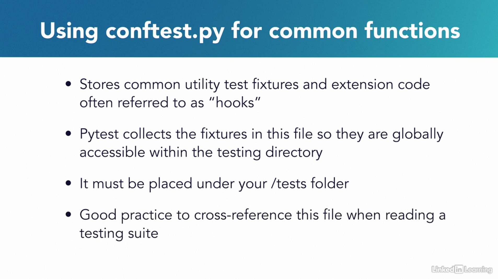
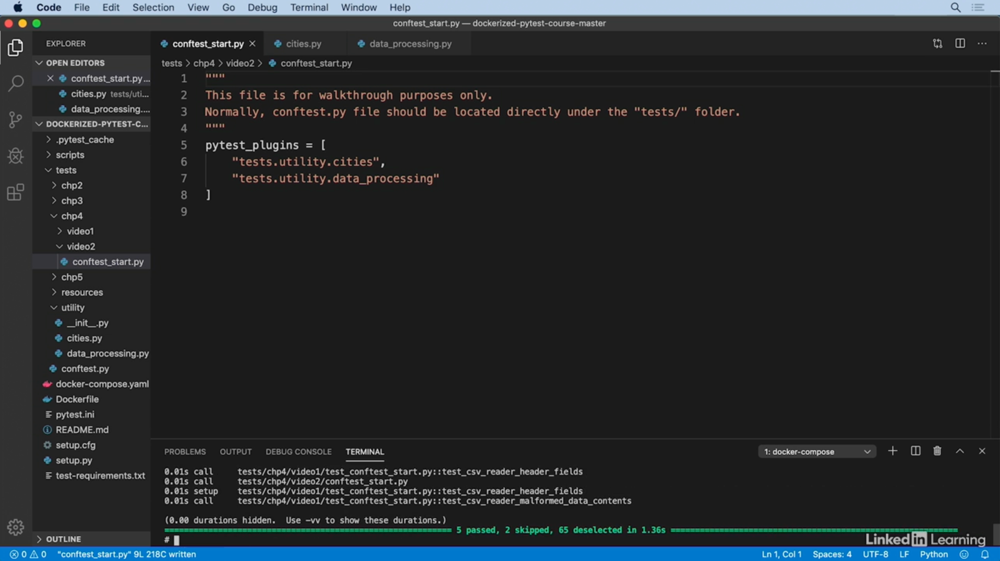
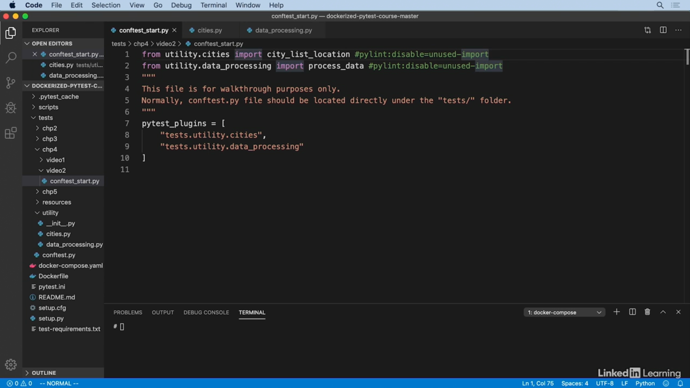

# Organizing Your Pytest Project

## Using `conftest.py` for common functions

## Modularizing `conftest.py`

- In the previous example, our `conftest.py` file held two fixtures but imagine what would happen if your system grew.
This file could grow to contain a large amount of fixtures giving each one limited visibility.
- One way to overcome this problem is to modularize your fixtures or store them in their own directories. Then you can import them into
`conftest.py` and use them as you had before.
- You can achieve this in a few ways. I'll show you two that I'm familiar with. Before we begin, you'll notice that this
file, `conftest_start.py` is nested under our test directory two levels deep. It's under chapter four, video two. This
file is being shown for walkthrough purposes only. Normally, `conftest.py` should be located directly under the test
folder. This gives other tests the ability to access its fixtures and functions directly.
- To achieve modularization, first, let's delete our fixtures from `conftest.py`. Make sure to leave one blank line at
the end of this file. Additionally, we can remove all of our imports except pytest.
- Before proceeding, let's check out where I've moved these fixtures. I've moved them to locations under the utility
folder in our test suite. Here, in `cities.py`, you'll see the fixture `city_list_location` is returning our test
directory's path to our files.
- Next, let's load these modules into `conftest_start.py`. To get started, you could use the **pytest plugins** keyword
and put them into a list making each line reference an import. Before I run the test, I can even remove the pytest
import. And here we have it, your test still runs.
- Now, let me show you another way we could achieve the same thing. I'm going to clear the output before I move back
into the IDE. Another way of doing this is to import the files directly into the `conftest.py` file, but you will need
to disable Pylint and Pyflakes from linting the file and throwing an error because the import will remain unused in the
file.
- **One thing to remember if you're using a fixture scoped to the session and marked for auto use, it cannot be
imported. It must remain in the `conftest.py`.**
