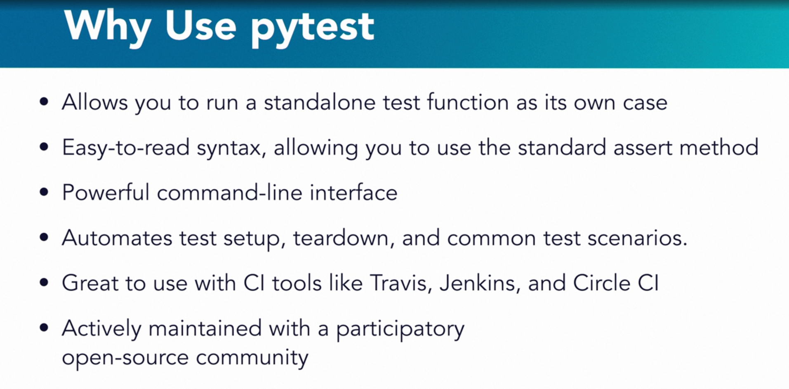

# Introduction

## Python unit testing with pytest

- Photo credit: Linkedin
- As a developer, you're constantly prioritizing what you should focus on and figuring out how today's work fits into
those long-term goals. When building and testing Python projects from scratch, you may lose sight of this goal as you
try to implement too many features at once. When maintaining a Legacy project, you may feel overwhelmed as you find it
has too few or no tests. Believe it or not, test-driven development may be just what you need to organize the path ahead
of you. We'll explore that in this course in concert with pytest, a testing framework.
- I'm Jasmine Omeke, and I'm a software developer working on a big data and analytics platform. I've also contributed to
open source projects such as gRPC, Apache Airflow, and pytest. I have learned a lot about prioritization, and I want to
talk about that through the lens of pytest.
- We will focus on pytest and its capabilities. Paired with test-driven development, pytest will help you become more
productive as you pragmatically write modular tests. To help you continue practicing your newfound pytest knowledge,
I will recommend potential sample projects as we make our way through the course.
- I'm excited to have you join me, and please let me know what feedback you have.

## Why pytest?

- Photo credit: Linkedin
- Pytest has a few critical features that set it apart from other testing frameworks, such as unittest, nose, and
doctest. There are many resources that account for the pros and cons between these four frameworks. For our purposes,
I'll give you an overview of how they perform in comparison to pytest when used in larger projects with many
dependencies.
- First, the pytest framework allows you to run a **standalone test function** as its own case, **unlike unittest**,
where you need to **put your test into classes and handle class inheritance**. This is great because that means it'll be
easier for you to define tests and also easier for the next programmer to come along and maintain your tests.
- Additionally, pytest has an easy-to-read syntax, allowing you to use the **standard assert method in combination with
comparison operators** to test scenarios in your test functions. Unittest, on the other hand, has over **10 different
assertion methods** for tests. While they are specific, they have changed in different versions of Python. This requires
you to keep up with these changes and update your project with the proper method if the old version becomes deprecated.
- To help you iterate through refactoring in a focused manner, pytest also gives you a powerful **command-line interface**
to control the tests you'd like to run over or even **skip with markers**. This comes in handy when you are updating a
portion of your test and don't want to run the entire test suite as you iterate through a small set of changes.
- Furthermore, pytest uses **fixtures to automate test setup, teardown, and common test scenarios** for use in varying
scopes. Fixtures also help you **share data and code between tests** that need common setup functions.
- The test automation Python provides doesn't stop there. It also comes with a feature called **parameterization**,
which enables you to automate test functions to run over a variety of scenarios in one swoop. This makes pytest a great
framework for complex testing scenarios, unlike doctest, which is great for basic tests, but it limits your test to
doc strings.
- Lastly, pytest is **actively maintained**. While it may be compelling for you to use nose, another framework,
it's no longer actively managed. In comparison, the pytest open source project is actively developed, and even you can
create issues for others to work on, or submit pull requests to improve the framework. You can read more about pytest
when you visit their documentation website for detailed information and walkthroughs for the framework's capabilities.
- To get to the core of each concept, I will walk you through how to implement it yourself. Toward the end, we will
cover how to spot these pytest features in an already set up project. This will be a great skill to have as a developer
because you'll inevitably have to maintain projects written by others and refactor them.
